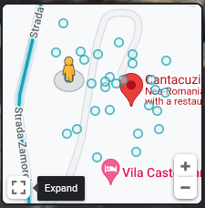
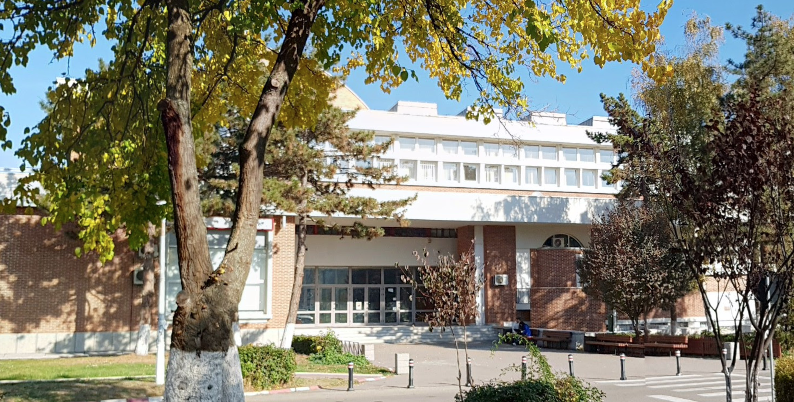
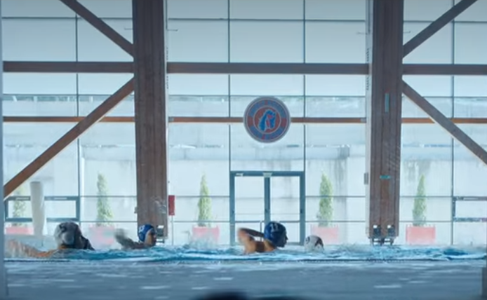
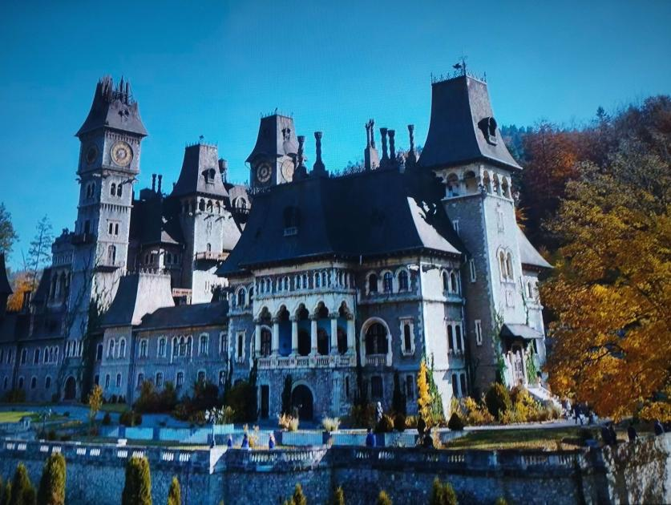
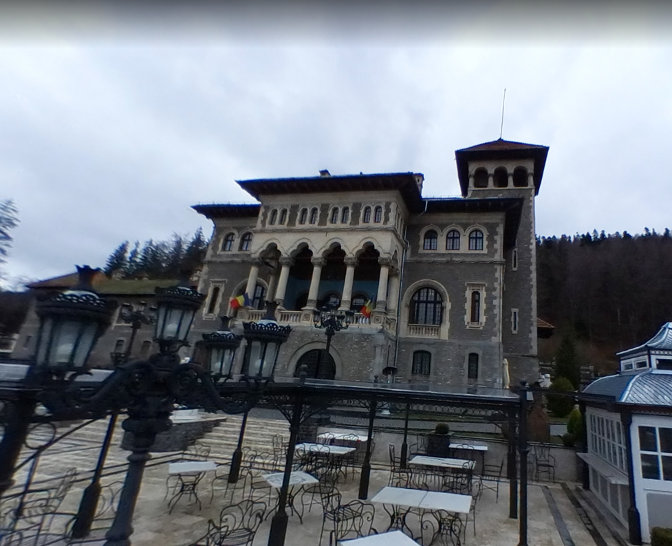
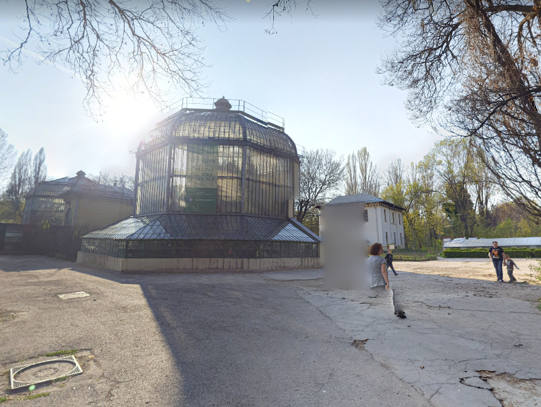
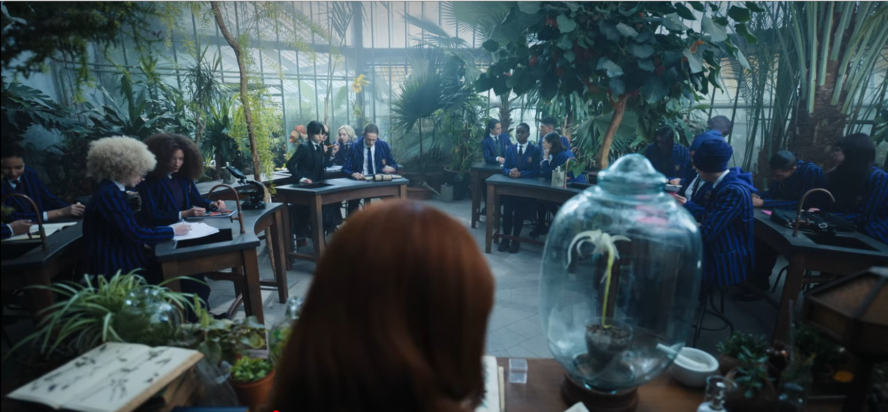
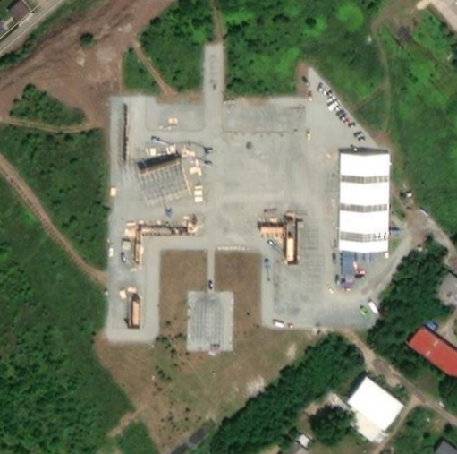

## Introduction
{: id="intro" }

*Wednesday* was primarily shot in and around Bucharest, Romania. Here we will show you the real-world locations of various places in the Wednesday universe in the order in which they were introduced in the show.

While we aim to reduce spoilers as much as possible, some location names or descriptions may reveal plot points from the show. To help readers avoid spoilers, we may revisit real-world locations multiple times and will clearly label it when we move on to the next episode.

The show was initially slated to be [filmed in Toronto, Canada][goldderby-markscruton].

### Disclaimer

While we provide location information for various real world locations used for filming Wednesday, please be aware that some places are private property. Please do not enter any location without permission.

It can be fun to own a piece of your favorite media, but remember that we want everyone to be able to share in our passion. Therefore, please do not remove any items not clearly marked as merchandise or cause damage at any of these locations.

All locations should be treated with respect and care.

### How to use this document
{: id="how-to-use" }

This document is broken up by episode, providing information and links to any locations introduced in that episode. We only revisit previously seen locations to point out information relevant to new plot points or relevant parts of the location.

In Google Maps Street View, some locations have views from several different spots. These can be viewed by double-clicking on the blue circles in the map square in the lower left corner.

At the end of this document, you'll find the [Location Index](#location-index), which breaks down each episode scene by scene to show you what was filmed where.

For information on this document or to suggest edits/additions, please contact @totengeist on Discord: [discord.gg/nevermoreacad](https://discord.gg/nevermoreacad)

## Episode 1 - Wednesday's Child is Full of Woe
{: id="S01E01" }

The day after the Wednesday premiere, Netflix Romania posted [a video containing comparison shots of some of the locations][youtube-netflixromaniatour] listed below. Be aware, there are some minor visual spoilers. 

### Nancy Reagan High School
#### Politehnica University of Bucharest

{: class="window" }

The very first scene of the show shows us Wednesday&rsquo;s high school, likely located somewhere in the state of New Jersey. The exterior is a building at the Politehnica University of Bucharest.

The license plate on the Addams family&rsquo;s car is registered in the state of New Jersey. Westfield, New Jersey was the hometown of Charles Addams and an inspiration for the original Addams Family comics. The Addamses also lived in the outskirts of New Jersey in the 2019 animated film.

[Website][politehnica] -
[Wikipedia][wikipedia-politehnica] -
[Google Maps Street View][gmst-politehnica]

### Nancy Reagan High School swimming pool
#### Bazinul de &Icirc;not Dinamo, Bucharest

{: class="window" }

The swimming pool at Nancy Reagan High School is the Bazinul de &Icirc;not Dinamo swimming pool in Bucharest, Romania. While you can&rsquo;t see the pool&#39;s interior on Google Maps, you can recognize the structure of the beams and windows.

Address: &#536;oseaua &#536;tefan cel Mare 7-9, Bucure&#537;ti 020121, Romania

[Google Maps Street View][gmst-inotdinamo]

### Nevermore Academy (exterior)
#### Cantacuzino Castle, Busteni

{: class="window" }

{: class="window" }

In-story location: Jericho, Vermont

Address: Strada Zamorei 1, Bu&#537;teni 105500, Romania

[Grounds Walkthrough Video][youtube-cantacuzinogrounds] - [Aerial Drone Footage Video][youtube-cantacuzinodrone]

[Website][cantacuzino-home] -
[Tours][cantacuzino-tour] -
[Wikipedia][wikipedia-cantacuzino] -
[Google Maps Street View][gmst-cantacuzino]

### Nevermore Academy (interior)
#### Casa Monteoru, Bucharest

Address: Calea Victoriei 115, Bucure&#537;ti, Romania

[Wikipedia][wikipedia-monteoru]

## Episode 2 - Woe is the Loneliest Number
{: id="S01E02" }

### Thornhill's classroom
#### Gradina Botanica Dimitrie Br&acirc;ndza (Bucharest Botanical Garden)

{: class="window" }

{: class="window" }

Address: &#536;oseaua Cotroceni 32, Bucure&#537;ti, Romania

[Google Maps Street View][gmst-gradinabotanica]

### Raven Island
#### Branesti Lake and Sterbei Lake
Address (Branesti Lake): Strada Oltului 26, Br&#259;ne&#537;ti 077145, Romania

Address (Domeniul &#536;tirbey Buftea): Strada &#536;tirbei Vod&#259; 36, Buftea 070000, Romania

[Google Maps Street View (Domeniul &#536;tirbey Buftea)][gmst-domeniulstirbey]

[Google Maps Street View (Branesti Lake)][gmst-branestilake]

### Burlington Station
#### Sinaia Train Station
Address: Sinaia 106100, Romania

## Episode 3 - Friend or Woe
{: id="S01E03" }

### Jericho, Vermont
#### Bucharest Film Studios backlot

The town of Jericho is a fictionalized version of the real-world Jericho, Vermont with a different history. According to a [map of Jericho][reddit-jerichomap] seen in the show, Nevermore is located a few miles out of town. The Jericho Town Square is a filming location built on a back lot at the Bucharest Film Studios in Buftea.

Address: Strada Studioului 1, Buftea 070000, Romania

[Google Maps Street View][gmst-bucharestfilm] -
[Bing Maps][bingmaps-bucharestfilm]

## Episode 6
{: id="S01E06" }

### Gates Mansion
#### Conacul Olga Greceanu

{: class="window" }

Once owned by Romanian painter Olga Greceanu, this manor in the Romanian country-side is the home of the Gates family on the outskirts of Jericho.

Address: Strada Eroilor 186, B&#259;lteni 137126, Romania

[Google Maps Street View][gmst-conaculolga]

## Location Index

### Episode 1
{: id="" }

| 0:10 | 0:12 | [Nancy Reagan High School exterior](#nancy-reagan-high-school) |
| 0:12 | 1:50 | Nancy Reagan High School interior (unconfirmed building at Politehnica University of Bucharest) |
| 1:50 | 2:50 | [Nancy Reagan High School swimming pool](#nancy-reagan-high-school-swimming-pool) |
| 2:50 | 4:00 | Titles |
| 4:00 | 7:00 | Unconfirmed road; likely Transylvania, Romania |
| 7:00 |  | Unconfirmed forest |
{: class="col-lg-12" }

### Episode 2
{: id="" }

| 0:50 |  | [Nevermore Academy exterior](#nevermore-academy-exterior) |
| 1:00 |  | [Nevermore Academy interior](#nevermore-academy-interior) |
| 15:50 |  | [Thornhill's classroom](#thornhills-classroom) |
|  |  |  |
|  |  | Raven Island |
|  |  | [Burlington Station](#burlington-station) |
{: class="col-lg-12" }

[bingmaps-bucharestfilm]: https://www.bing.com/maps?cp=44.57411%7E25.932305&lvl=18.0&style=h

[cantacuzino-home]: https://www.cantacuzinocastle.com/homeeng
[cantacuzino-tour]: https://www.cantacuzinocastle.com/vizitareeng

[gmst-branestilake]: https://www.google.com/maps/@44.4524374,26.3334686,3a,75y,216.55h,91.08t/data=!3m7!1e1!3m5!1sQRSzOwUH_2Q4Vt3a2ukgXw!2e0!6shttps:%2F%2Fstreetviewpixels-pa.googleapis.com%2Fv1%2Fthumbnail%3Fpanoid%3DQRSzOwUH_2Q4Vt3a2ukgXw%26cb_client%3Dmaps_sv.tactile.gps%26w%3D203%26h%3D100%26yaw%3D323.1341%26pitch%3D0%26thumbfov%3D100!7i16384!8i8192
[gmst-bucharestfilm]: https://www.google.com/maps/place/44%C2%B034'26.6%22N+25%C2%B055'55.4%22E/@44.5742056,25.931613,302m/data=!3m1!1e3!4m13!1m7!3m6!1s0x0:0x5544075c1ac17a3a!2zNDTCsDM0JzI2LjYiTiAyNcKwNTUnNTUuNCJF!3b1!8m2!3d44.5740573!4d25.9320501!3m4!1s0x0:0x5544075c1ac17a3a!8m2!3d44.5740573!4d25.9320501
[gmst-cantacuzino]: https://www.google.com/maps/@45.4127013,25.5417319,3a,50.1y,27.18h,111t/data=!3m11!1e1!3m9!1sAF1QipPN0XbEpEP5gCoairv294M8oB6sbM2OptVPq7mU!2e10!3e11!6shttps:%2F%2Flh5.googleusercontent.com%2Fp%2FAF1QipPN0XbEpEP5gCoairv294M8oB6sbM2OptVPq7mU%3Dw203-h100-k-no-pi0-ya281.74854-ro-0-fo100!7i8704!8i4352!9m2!1b1!2i20
[gmst-conaculolga]: https://www.google.com/maps/place/Conacul+Olga+Greceanu/@44.668899,25.6870647,3a,28.8y,275.26h,93.26t/data=!3m6!1e1!3m4!1sy4QARgZhhS2feVL-ZnRGOg!2e0!7i16384!8i8192!4m5!3m4!1s0x40b26dbfb59e8aaf:0x8b3e0a4d9f914cdc!8m2!3d44.6687448!4d25.6863689
[gmst-domeniulstirbey]: https://www.google.com/maps/@44.5659542,25.9388819,3a,75y,328.36h,90.2t/data=!3m8!1e1!3m6!1sAF1QipNkxm9TeSpV43a0nbvmkxGX0921sigCTQPTalU2!2e10!3e11!6shttps:%2F%2Flh5.googleusercontent.com%2Fp%2FAF1QipNkxm9TeSpV43a0nbvmkxGX0921sigCTQPTalU2%3Dw203-h100-k-no-pi-0-ya238.29187-ro0-fo100!7i2508!8i1254
[gmst-gradinabotanica]: https://www.google.com/maps/@44.4386233,26.0628479,3a,75y,269.61h,100.16t/data=!3m8!1e1!3m6!1sAF1QipNSeZH0mf9h4Q39sbg8avEYAz3ALuPiqe7eFEWQ!2e10!3e11!6shttps:%2F%2Flh5.googleusercontent.com%2Fp%2FAF1QipNSeZH0mf9h4Q39sbg8avEYAz3ALuPiqe7eFEWQ%3Dw203-h100-k-no-pi-0-ya143.33755-ro-0-fo100!7i10240!8i5120
[gmst-inotdinamo]: https://www.google.com/maps/@44.4560312,26.1048411,3a,75y,293.8h,100.71t/data=!3m10!1e1!3m8!1sqfi-QCHKzBAep6Aotk2opw!2e0!6shttps:%2F%2Fstreetviewpixels-pa.googleapis.com%2Fv1%2Fthumbnail%3Fpanoid%3Dqfi-QCHKzBAep6Aotk2opw%26cb_client%3Dmaps_sv.tactile.gps%26w%3D203%26h%3D100%26yaw%3D7.850759%26pitch%3D0%26thumbfov%3D100!7i16384!8i8192!9m2!1b1!2i20
[gmst-politehnica]: https://www.google.com/maps/@44.4382941,26.0499374,3a,75y,23.67h,95.85t/data=!3m8!1e1!3m6!1sAF1QipOXUAFQKjJURyvtUhhJvgm5rbqz_Sx00tkKmZih!2e10!3e11!6shttps:%2F%2Flh5.googleusercontent.com%2Fp%2FAF1QipOXUAFQKjJURyvtUhhJvgm5rbqz_Sx00tkKmZih%3Dw203-h100-k-no-pi-0-ya189.01361-ro0-fo100!7i10240!8i5120

[goldderby-markscruton]: https://www.goldderby.com/video/mark-scruton-interview-wednesday-production-designer/
[politehnica]: https://upb.ro/en/
[reddit-jerichomap]: https://i.redd.it/w8qc2efwjb3a1.png

[wikipedia-cantacuzino]: https://en.wikipedia.org/wiki/Cantacuzino_Castle
[wikipedia-monteoru]:    https://en.wikipedia.org/wiki/Monteoru_House
[wikipedia-politehnica]: https://en.wikipedia.org/wiki/Politehnica_University_of_Bucharest

[youtube-cantacuzinodrone]:   https://youtu.be/qyus5ijRaow
[youtube-cantacuzinogrounds]: https://youtu.be/81EQjA7Jeag?t=28
[youtube-netflixromaniatour]: https://youtu.be/IfrgqyC4sFY